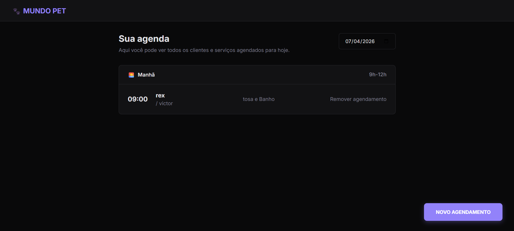

### 🌟 Introdução

* **Nome do Projeto:** Mundo Pet 🐾
* **Contexto:** Desenvolvido como um desafio prático da formação **Full-Stack JavaScript: JavaScript Antes do Framework**, da **Rocketseat**.
* **Objetivo Principal:** O desafio central do projeto foi criar um sistema funcional de agendamento para um Pet Shop, focando no domínio do JavaScript puro (Vanilla JS) e na manipulação do DOM, antes de introduzir frameworks modernos como React ou Vue.
* **Detalhes Relevantes:** Este projeto representa um marco importante no aprendizado de arquitetura de software, pois foca na organização de módulos, uso de ferramentas de build (Webpack/Babel) e no consumo de APIs simuladas, sendo muitas vezes o primeiro contato do desenvolvedor com um ambiente de desenvolvimento profissional estruturado.

---

### 🚀 Principais Funcionalidades

O projeto é uma aplicação web interativa voltada para a gestão de serviços de um Pet Shop:

1.  **Agendamento de Serviços:** O usuário pode preencher um formulário informando o nome do pet, nome do tutor, telefone, tipo de serviço e o horário desejado.
2.  **Listagem em Tempo Real:** Ao realizar um agendamento, os dados são processados e exibidos dinamicamente em uma lista de "Agendamentos do Dia".
3.  **Remoção de Agendamentos:** Existe a funcionalidade de cancelar ou remover um agendamento da lista, com a atualização imediata da interface.
4.  **Validação de Dados:** O sistema garante que as informações essenciais sejam preenchidas antes de enviar o formulário.
5.  **Interface Responsiva:** A aplicação foi desenhada para funcionar tanto em desktops quanto em dispositivos móveis, adaptando o layout para uma melhor experiência do usuário.

---

### 🛠️ Tecnologias Utilizadas

* **HTML5 & CSS3:** Estruturação semântica e estilização visual moderna, utilizando Grid e Flexbox para o layout. 🎨
* **JavaScript (ES6+):** A linguagem principal, utilizada para toda a lógica de negócio, manipulação de eventos e integração com a "API". 🧠

---

### 📸 Aparência do Projeto

---

### 📚 Lições Aprendidas

O desenvolvimento deste projeto proporcionou aprendizados técnicos cruciais:
* **Gerenciamento de Estado da UI:** Compreensão de como atualizar a tela do usuário de forma eficiente conforme os dados no "servidor" mudam.
* **Configuração de Ambiente:** Primeira experiência configurando ferramentas de desenvolvimento como Webpack do zero.

---

### 🏁 Conclusão

O projeto **Mundo Pet** é um excelente exemplo de como aplicar conceitos fundamentais de desenvolvimento web em um cenário do mundo real. A superação do desafio de integrar o front-end com uma API simulada, mantendo o código limpo e organizado, traz uma grande satisfação e prepara a base sólida necessária para avançar para frameworks como o React. É um projeto que demonstra atenção aos detalhes e domínio da lógica de programação. ✨
